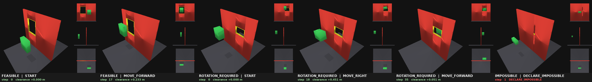

# Physical Passage

**3D 碰撞与可行性推理游戏**(Physical Passage: A 3D Collision and Feasibility Reasoning Game)——面向 VLA/VLM 物理推理研究的极简 3D 实验台。

一个**绿色长方体**要在不接触**红墙**的前提下,经平移+旋转穿过墙上的**黄色孔洞**。游戏专门用来验证 AI 能否从视觉输入学会:三维空间占据 → 物体尺寸/姿态理解 → 几何可行性判断 → 连续轨迹碰撞 → **不可行任务识别**(不硬闯,输出 DECLARE_IMPOSSIBLE)。

前作 2D 版:[vla-dodge-lab](https://github.com/qiaoxu123/vla-dodge-lab)(位置对齐→几何可行性的完整对比结论)。



*三类关卡各一局(oracle 专家):FEASIBLE 直接穿过;ROTATION_REQUIRED 必须旋转 90° 才能过;IMPOSSIBLE 孔比物体最小截面还小,正确输出 DECLARE_IMPOSSIBLE。左=主视角(喂模型),右=正/侧/俯三视图(仅做标签)。*

## 技术栈(为什么不是 Unity)

**PyBullet + EGL GPU 无头渲染**(RTX 4090)。原规格建议 Unity,但本机纯终端工作流、无 Unity/Godot;PyBullet pip 即装、原生 Python、天然支持规格书的硬需求:Gymnasium API、无头批量千级 episode、RGB/Depth/Segmentation 导出。渲染一帧 448² 约 1-3ms。

## 核心设计

| 子系统 | 做法 |
|---|---|
| 场景 | 墙+孔 = 4 个凸 box 框(左右上下),保持凸-凸 GJK 快而精确;黄色孔沿/灰地面为纯视觉体 |
| 运动 | 长方体 kinematic(mass=0),`resetBasePositionAndOrientation` 移动;**从不 stepSimulation**,只 `performCollisionDetection`(MVP 无重力/惯性) |
| 动作(14) | ±x/±y/±z 平移 0.05m、±rx/±ry/±rz 旋转 5°、STAY、**DECLARE_IMPOSSIBLE**;步长可配 |
| 离散碰撞 | `getClosestPoints` 签名距离 → `minimum_clearance`(负=穿透);注意 PyBullet ~1e-2 碰撞 margin |
| 连续碰撞 | 每动作 8 substep(位置 lerp + 四元数 slerp)逐点查询 → `trajectory_collision_flag` / `time_to_collision`;**起终点合法但中间碰撞也判失败**(实测能抓 tunneling 和"孔内旋转撞框") |
| 可行性 GT | ①解析筛:孔短边 < 物体最小边 ⇒ 任何姿态都过不去(投影宽度下界);②过孔搜索:三个面族 × 5° 旋转网格,用真实碰撞引擎扫掠直穿验证 ⇒ feasible / rotation_required / impossible;顺便产出**专家动作序列**(后续 BC 数据) |
| 生成器 | 按构造采样三类(目标比例 30/50/20)+ 求解器验证不合重采;起点/孔心贴 0.05m 网格保证离散动作能精确对齐 |
| 成功判定 | 整个 AABB 严格越过墙远面 + **全程(含 substep)零接触**;对 impossible 关输出 DECLARE_IMPOSSIBLE = 成功(+80) |
| 相机 | **主输入 = 固定斜上方第三人称透视**(俯角 35°,448²);正/侧/俯三视图(256²)仅生成深度/碰撞标签,不喂模型。先固定视角验证物理能力,后续再随机化排除模板记忆 |

## 实测:oracle 上限 vs 零样本 VLA baseline

| 指标 | oracle(30关) | **Qwen2.5-VL-3B 零样本(12关)** |
|---|---|---|
| 可行关成功率 | **26/26** | **0/8**(全部撞墙) |
| 碰撞率 | 0.0 | **1.0** |
| 无解关识别召回 | 1.0 | **0.0**(从不认输,径直撞墙) |
| 单步延迟 | ~0 | 95 ms |

零样本 VLA 的行为**100% 塌缩成 MOVE_FORWARD**:不对齐、不旋转、不认输,每关 9-10 步撞墙。
它有"往前穿孔"的语义先验,但完全没有 3D 对齐/姿态/可行性推理——与 2D 版结论一致且更彻底
(2D avoid 0.07,3D 直接 0)。这正是本实验台要制造的差距:**留给模仿学习/微调去填**
(oracle 专家序列已就绪,复用 vla-dodge-lab S1/S2 方法论)。

复现:`python scripts/run_vla.py --episodes 12`(需带 transformers 的环境,如 `habvln`)。

## 运行

```bash
# conda env: physpass (python 3.10, pip install -r requirements.txt)
python tests/test_collision.py        # 碰撞单元测试(6 项:符号/tunneling/孔内旋转)
python tests/test_solver.py           # 求解器三类标签测试(6 项)
python scripts/run_oracle.py --episodes 30    # 端到端评测 -> results/metrics/
python scripts/make_demo.py           # 三类关卡演示 GIF(四视图+HUD)
```

## Python 接口(Gymnasium)

```python
from physical_passage.envs.passage_env import PassageEnv
env = PassageEnv()
obs, info = env.reset(options={"label": "rotation_required"})  # obs["rgb"]: 448x448x3
obs, r, term, trunc, info = env.step(action)                    # Discrete(14)
# info: collision / minimum_clearance / time_to_collision /
#       feasible_ground_truth / passed_wall / position / rotation_euler_deg
```

## 结构

```
physical_passage/
├── sim/connection.py       # DIRECT + EGL 插件(顺序关键)
├── scene/{spec,builder,generator}.py
├── collision/{evaluator,swept}.py
├── solver/feasibility.py   # 解析筛 + 扫掠过孔搜索 + 专家计划
├── render/observer.py      # 主透视 448 + 三近正交 256(EGL 不支持真正交,用远距窄FOV)
├── envs/{actions,passage_env}.py
├── logging/logger.py       # steps.jsonl + episodes.jsonl
└── metrics/offline.py      # 成功率/碰撞率/可行性准确率/召回/误报 -> CSV+JSON
scripts/{run_oracle,make_demo}.py
tests/{test_collision,test_solver}.py
configs/default.yaml        # 所有步长/角度/分辨率/比例/奖励
```

## 路线图(规格书难度递进)

- [x] **Level 1 MVP**:长方体+矩形孔,离散动作,无动力学,三类关卡,oracle 全通
- [ ] 反事实模式(Action Evaluation Mode:分支模拟所有候选动作)已有基础(swept_check 即查即回)
- [ ] Level 2+:异形物体/孔洞(L形/T形/圆柱)→ 动力学(惯性/延迟)→ 多层墙 → 部分可观测 → 语言条件规则
- [ ] BC/VLA 接入:oracle 专家计划即演示数据,复用 vla-dodge-lab 的 S1(CNN-BC)/S2(LoRA 微调)方法论
